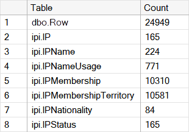

# test

The objective of this test is to use a small amount of real data to check if the ETL process works correctly in your environment. There are 4 EDI IPI files with *consecutive dates* as test data. Although by importing these 4 files you will not have at your disposal the entire and up-to-date IPI database the test will give you a rough idea how the ETL pipeline works. 

Before executing the test make sure that your database is **initialized properly**. Check the *dbo.Config* and *dbo.File* tables:

```
SELECT * FROM [dbo].[Config]

SELECT [FileID], [File], [SID], [FirstRowID], [LastRowID], [Note], [RefDate]
FROM [dbo].[File]
```

If your database is initialized properly, then the result sets should be:

```
[dbo].[Config]
----------------------------------------------------------------
DiffPath                  | DatabaseState | LastCommitedHeaderID
----------------------------------------------------------------
<path-to-your-file-store> | 0             | 0
----------------------------------------------------------------

[dbo].[File]
-------------------------------------------------------------------
FileID | File         | SID  | FirstRowID | LastRowID | RefDate 
-------------------------------------------------------------------
1      | 20130529.IPI | NULL | 0          | 0         | 2013-05-29
-------------------------------------------------------------------
```

If these two tables are empty execute the procedure *dbo.InitializeDatabase* and check again. Note that you cannot execute the ETL process if the database is not in *READY* state (DatabaseState=0). 

Make sure that all test files are stored in *path-to-your-file-store*.

**Now start the ETL process**:

```
EXEC dbo.Process
```

It will take few minutes to finish. When the process is over all data should be in the *ipi* tables:

<div>
  
  <br /><br />
</div>

If you check the output of the execution you'll find the description of the ETL process:

```
New session 1 is created.
=============================================================
THE PROCESSING STARTED. DATABASE IS IN PROCESSING STATE.
=============================================================
Checking identity information: current identity value 'NULL'.
DBCC execution completed. If DBCC printed error messages, contact your system administrator.
-----------------------------------------------
Import table has been cleared and reseeded.
Next RowID set to: 1
-----------------------------------------------
File 20130530.IPI: import finished.
File 20130531.IPI: import finished.
File 20130601.IPI: import finished.
File 20130602.IPI: import finished.
-------------------------------------------
RowCodes have been parsed.
Import header is valid.
-------------------------------------------
Parsing started...
BDN parser finished: 251
BDO parser finished: 86
...
...
...
TMA parser finished: 11539
Parsing completed.
---------------------------------------------------------
Updating HeaderID in 4 package(s). Please wait...
4
3
2
---------------------------------------------------------
Update of HeaderID is finished.
Header in dbo.Row table (dbo.Row) UPDATED.
New transactions have been added (444).
-------------------------------------------
Imported data has been successfully parsed.
The processing started...
#3>IPA
#238>IPA
...
...
...
#25271>BDU
The processing completed.
Duplicates of IPNameUsage removed.
=============================================================
THE PROCESSING COMPLETED. DATABASE IS IN READY STATE.
=============================================================
```

If you want to test more data after the initial test is done, make sure that all further files have consecutive dates that continue the last date from initial import *without any gap*. Each day must be represented by a *single* file. And, the most important, the content of files must *strictly* implement the **EDI protocol for the IPI system**.

